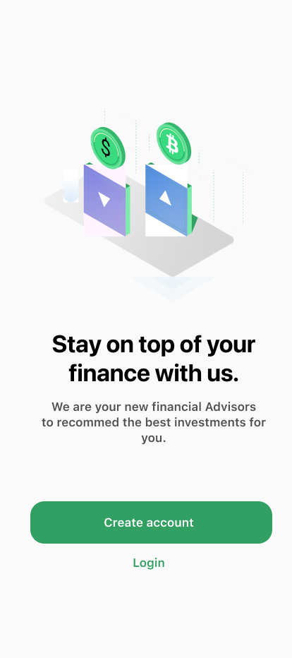

#Investment App UI design

## Description

Welcome to the first episode of "Mastering Flutter: Building an Innovative Investment App from Scratch"! In this series, we embark on an exciting journey into the world of Flutter app development, guiding you step-by-step towards creating a cutting-edge investment app.

In this inaugural episode, we lay the foundation for your Flutter development adventure. We start by walking you through the process of setting up your development environment, ensuring you have all the necessary tools to get started. From installing the Flutter SDK to configuring Android Studio or Visual Studio Code with essential plugins, we cover everything you need to kickstart your Flutter journey.

Next, we delve into the core concepts of Flutter. We explore widgets, the building blocks of Flutter UI, and teach you how to create stunning user interfaces. Understanding state management is crucial for building dynamic apps, so we demystify this topic and provide you with different approaches to managing state in your Flutter application. Lastly, we tackle the topic of routing, enabling seamless navigation between screens in your investment app.

Throughout this episode, we provide clear explanations, practical examples, and insightful code demonstrations. By the end, you'll have a solid understanding of Flutter's fundamentals and be ready to embark on the exciting development of your investment app.

## Important Links
* Dribble Design: https://dribbble.com/shots/13964023-Investment-Ui-Ux
* Youtube Tutorial: https://youtu.be/VOuMy3RVb5g

## Output

## Design

| Initial Phase                                                      | Final Phase                                                             |
|--------------------------------------------------------------------|-------------------------------------------------------------------------|
|  |  |
